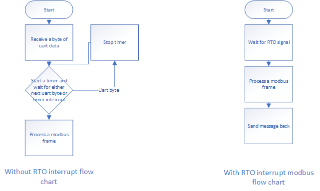

# FreeRTOS DMA_Uart Freemodbus STM32_RTO and CRC_hardware_DMA

This is a modbus STM32 project using Freemodbus. FreeRTOS manage various of different tasks. In order to achieve the maximum capability of STM32 hardware, DMA was used for diferent peripherals, such as uart, crc. As RTO (receiver timeout) in uart was used, a modbus frame can be obtain through uart RTO interrupt. CRC is used as well, and DMA will transfer data from uart receive memory to CRC data register, which can significantly reduce the CPU utilization. For this project, I use Atollic TrueStudio as my IDE, and it is supposed to word on other gcc based IDE such STM32CubeIDE and System Workbench for STM32.

## UART DMA

In this section I will explain how to use uart with DMA to send and receive data.

### UART DMA SEND

I set uart baud width as 115200 bits/second, stopbit 1 and parity check as odd. Be careful here, the word length is set 9 bits, this 9 bits is 8 bits plus parity bit. For DMA part, I use normal mode, the address of peripheral is fixed, and the address of memory will increase at end of every DMA cycle. After initialize and link the uart and dma peripheral, just call __HAL_UART_Receive_DMA(UART_HandleTypeDef *huart, uint8_t *pData, uint16_t Size)__ to send data by DMA.

### UART DMA RECEIVE

The DMA receiving scenario is different from sending. Every time uart sense data comes in, dma will automatically move data into destination, and not trigger interrupt. The interrupt will only be triggered when the waiting time is over 32 bits (9 bits * 3.5 = 31.5 bits round to 32 bits). In the UART RTO interrupt, the CPU will send a signal to tell the modbus task that a frame is ready. As timeout receiving is automatically done by hardware, programmer does not have to worry about write a timer interrupt to judge whether a frame is ready or not. here is a flow chart shows difference between with RTO and without RTO.

